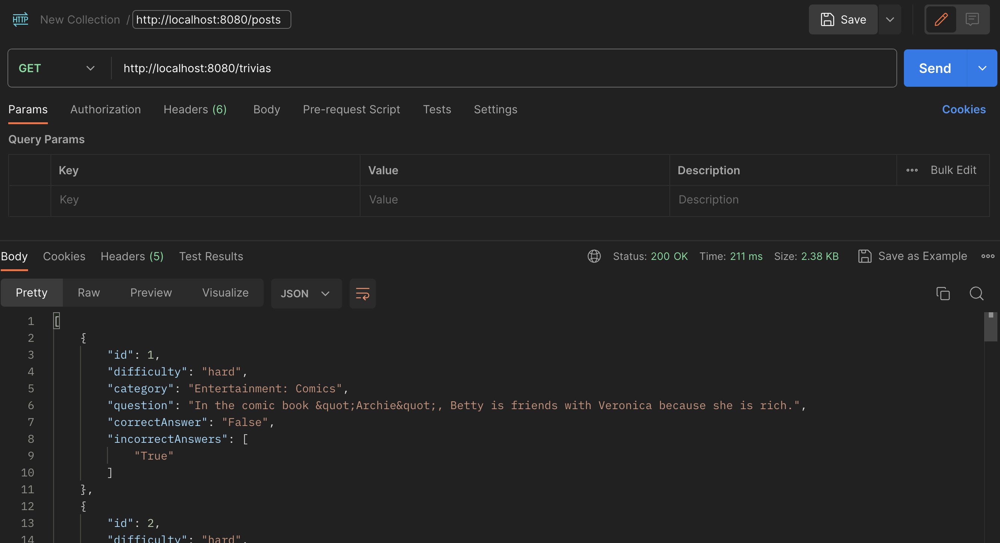

# TriviaAPI

An Spring Boot Java API for the Trivia application to save scores, games history, re-try past game

# TriviaAPI

An Spring Boot Java API for the Trivia application to save scores, games history, re-try past game

## Demo & Snippets

- [Live Code](https://github.com/rianns/TriviaAPI)
- 

## Requirements / Purpose

- MVP
  This project is an extension of the [Trivia UI](https://github.com/rianns/trivia-ui) Your task is to create an API that will allow users to keep track of the quiz games they played.

  - When the user completes a quiz it gets submitted to the API that keeps track of all game details:

    - score
    - date played
    - questions answered
    - submitted answer for each question
    - correct answer for each question
    - if a question was failed or not

  - One of the API endpoints should allow filtering questions by failed

  - (Front-end updates)
    - On the frontend, the user should be able to view questions that they answered wrong
    - They should be able to attempt those questions again
    - If they answer the question correct, it should get archived in the database

- Purpose

  - Create an app that will allow users to play trivia and display a score at the end of each game

- Stacks used

  - Java
  - Spring Boot
  - Flyway (DB version migration)

## Build steps

1. Use [Spring Initializr](https://start.spring.io/) to create a new project
2. Add dependencies
   - Spring Web
   - Spring Boot DevTools
   - Validation
   - MySQL Driver
   - Spring Data JPA
   - Flyway Migration
3. Add entity classes in src/main/java (Game entity, Trivia entity)
4. Create repositories extended from JpaRepository and services linked to their controllers
5. Create controllers for each entity with CRUD methods and other specific methods
6. Create migration in src/main/resources/db/migration folder for TriviaDatabase
7. Run the application

### Required installations

- Postman for API testing

## Design goals / Approach

- OOP approach
- version design for database migration

## Features

- User can choose level of difficulty
- User can save previous games
- User can save score

## Known Issues

- incorrect_answers is saved as VARBINARY(255) in database

## Future goals

- add history of multiple games

## Change logs

18/07/2023 - Initial commit
27/07/2023 - Added game and trivia entities and respective controllers
28/07/2023 - Added migration

## Licensing details

- No license

## Further details, related projects, reimplementations

- TBD
